# Strings_Attached
An online shop and lesson hub for guitarists. 

Source code can be found [here](https://github.com/johnrearden/strings_attached)

The live project can be viewed [here](https://strings-attached-jr.herokuapp.com)

## Purpose of Project
The aim of the project is to help users on their journey to musical proficency. The website consists
of a shop where instruments and accessories can be purchased, and subscriptions to music lesson videos 
can be signed up to. 

---

## Links to content

[**Purpose of Project**](#purpose-of-project)

[**ECommerce Business Model**](#ecommerce-business-model)

[**Web Marketing**](#web-marketing)

[**Features**](#Features)

[**User Experience**](#User-Experience)
- [Design](#design)
    - [Fonts](#fonts)
    - [Colour](#colour)
    - [Wireframes](#wireframes)

[**Development Process**](#Development-Process)
- [Project Planning](#project-planning-and-documentation-in-github)
- [Search Engine Optimization](#search-engine-optimization)
- [Data Model](#data-model)

[**Testing**](#Testing)
- [Manual Testing](#manual-testing)
    - [Feature Testing](#feature-testing)
    - [Responsiveness](#responsiveness)
    - [Lighthouse](#lighthouse)
    - [Code Validation](#code-validation)
        - [Python](#python-code)
        - [JavaScript](#javascript-code)
        - [HTML](#html-validation)
        - [CSS](#css-validation)
    - [User Stories](#user-stories)
- [Automated Testing](#automated-testing)
    - [Django testing](#testing-django-views-models-and-forms)

[**Bugs**](#Bugs)

[**Libraries and Programs Used**](#libraries-and-programs-used)

[**Deployment**](#Deployment)
- [Deploying the app on Heroku](#deploying-the-app-on-heroku)
- [Making a local clone](#making-a-local-clone)
- [Running the app in your local environment](#running-the-app-in-your-local-environment)

[**Credits**](#Credits)

[**Acknowledgements**](#acknowledgements)

---

## ECommerce Business Model
This project is a **B2C**, where the aim is to sell directly to consumers, rather than to businesses. As the customers are free to browse online stores and buy impulsively, it is a central design principle that the customer should be able to proceed through the selection and purchase process with an absolute minimum of friction. Thus, the site contains minimal extraneous information that would distract from this process.

The site offers both **products** and a **service**. The products are guitars and their associated accessories; strings, cases and cables. These are displayed in a grid layout, with the product image prominent. Selecting a card from the grid opens a full page product detail view, which is the only page that contains a significant amount of text, detailing the specific qualities of that product. A quantity of one can be added to the basket with only one button click, and the user can proceed to the checkout page with one more subsequent click, having checked that their basket contents are correct. On the checkout page, there is a form, with a checkbox enabling the user to save their information, so that subsequent purchases will only involve entering their card payment details. 

The digital service offered is a **subscription** to a selection of video lessons teaching the student the basics of how to play acoustic and electric guitar. The user can browse the courses on offer, and watch two videos from each course for free. A large clickable panel allow them to proceed to a page where they can pick the duration of their subscription, and clicking a duration card takes them straight to the Stripe payment page. Users are required to set up an account in order to subscribe, but this is the only occasion on which they need to enter PII before gaining instant access to their subscription. Payments are then taken automatically from their card at the end of each period.

Both **single payment** and **subscription** payments are handled by Stripe, and no card or payment information is held on the site.

## Web Marketing
A [facebook page](https://www.facebook.com/profile.php?id=100090721180796) was set up as the initial stage of a social media marketing strategy. The page mimics the styling of the site, and a Shop Now is prominent in the page description. An introductory first post was made to the page, containing another link to the site and inviting visitors to view the products and services on offer. In case the page is taken down, screenshots are included below.

---

## Features
The following pages are visible to all users, logged in or not.

Welcome Page (landing page)

- The landing page presents the user with a choice of 2 actions:
    - Shop for an instrument
    - Subscribe to a lesson plan
- The page, along with all the others, has a header which has the following elements, from left to right:
    - Site icon, clickable, which links from any page back to this one.
    - Search bar and button, which allows the user to search the products by keyword.
    - Logged in user display, which shows the name of the current user (blank if anonymous)
    - Staff dropdown selector, which gives the following options if user is a staff member
        - Add Product
        - Product List
        - Order List
    - Account dropdown selector, which gives 2 options if user is not logged in:
        - Register
        - Login
    - Basket link, which takes the user directly to the View Basket page.
- The page footer, also common to all pages, consists of a header element exhorting the user to Stay in Touch!, a link to the site's facebook promotional page, and an invitation to subscribe to a mailing list (with a MailChimp backend).

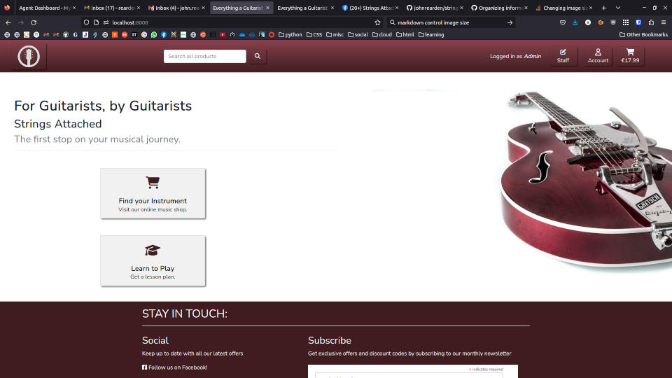

Product Display Page

-   This page displays the products (in tiled layout) according to one of the 5 category filters at the top of the page, or as filtered by a keyword search on the navbar.
-   If there are any valid special offers currently, they will cycle across the top of the page (using a Bootstrap Carousel)
-   The product tiles (Bootstrap Cards) are clickable, and link to their respective Product Detail Pages.

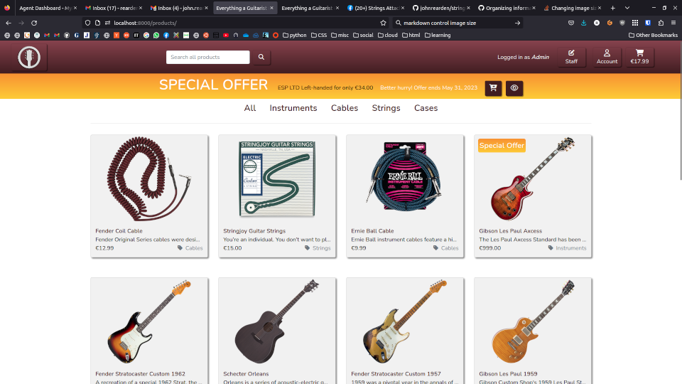

Product Detail Page

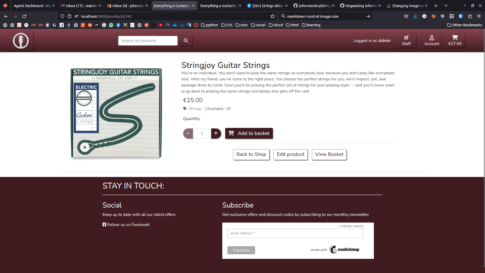

- This page consists of the following features:
    - An image of the product
    - The name and description (in full) of the product
    - The price, category, and number available to order (this may be less than the total stock)
    - A quantity input, range-bound (copied from the Boutique Ado project, with styling changes)
    - A primary Add To Basket Button, which adds the quantity in the input to the user's basket
    - Three buttons below the fold, which link respectively back to the shop, to the Edit Product page (only visible to logged in staff members), and the View Basket page.

Basket Page

- This page lists the items in the basket, once again offering the user the opportunity to change the quantity of the product being purchased (via a range-bound input), or remove the item from the basket entirely (via a button with a trash icon).
- It also contains buttons that link back to the All Products page, and clear the entire basket contents.
- The subtotal, delivery cost and total cost are shown in a simple table.
- A large blue checkout button links to the Checkout Page.

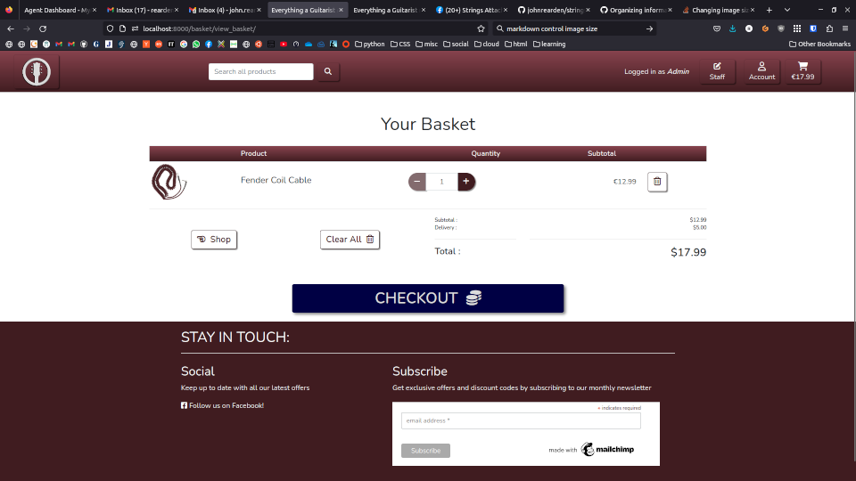

Checkout Page

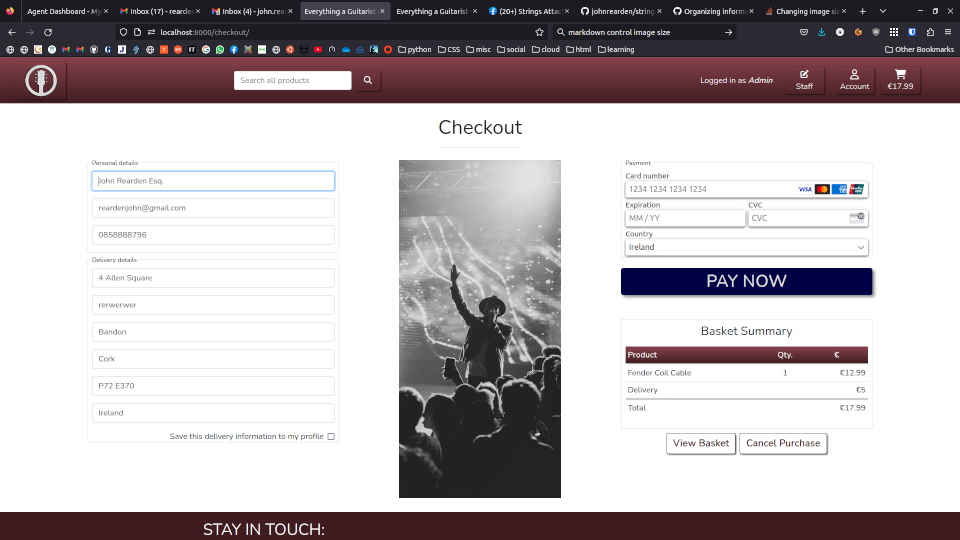

- The Checkout page consists of 3 main sections.
    - There is a form for the user's delivery details, at the bottom of which is a checkbox (unchecked by default) which enables them to request that their data be stored for future purchases.
    - There is the Stripe Payment element (with errors if present) which allows the user to enter the details of their payment method.
    - There is a concise summary of the basket contents once again, consisting of the product names, quantities and total costs, the delivery cost and the grand total.
- There are 2 buttons at the end of the page which allow the user to 
    - Return to the View Basket page.
    - Cancel the entire purchase. (Returns the user to the Product Display page)

Checkout Success Page

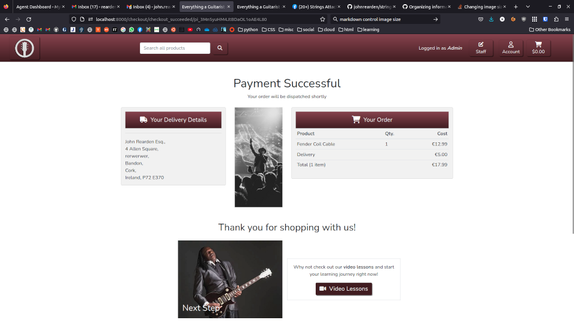

- The Checkout Success page shows a Payment Successful message to the user at the top, and then summarizes both the order and the delivery details. The lower half of the page consists of a call to action - encouraging the user to browse the video lesson section of the site with a view to subscribing to the full selection of content.

Video Lessons Page

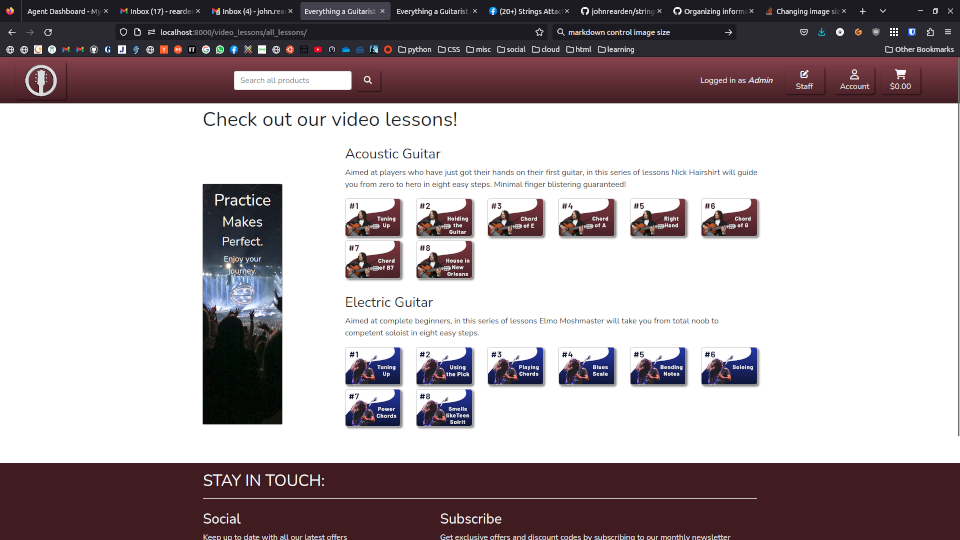

- This page consists of a panel in the left hand column of the screen, which displays either a Practice makes Perfect slogan (if the user has already successfully subscribed), or a Subscribe link (if not).
- The rest of the page consists of the available lessons, categorized by course. The first two lessons are available to all users, but the remainder on each course have a padlock icon on them and are not selectable unless the user is a paid up subscriber.

Video Player Page

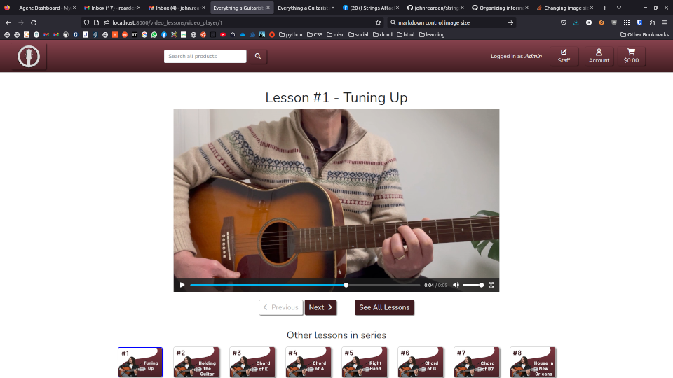

- Most of this page is taken up with the &lt;video> element. Below this are three buttons: Previous, Next and All Lessons. The previous and next buttons are disabled when the user has selected the first and last lessons respectively. At the bottom of the page is a series of thumbnails for the other lessons in the series, so that the user can navigate directly to one of them without having to press the Next and Previous buttons repeatedly.

Login Page

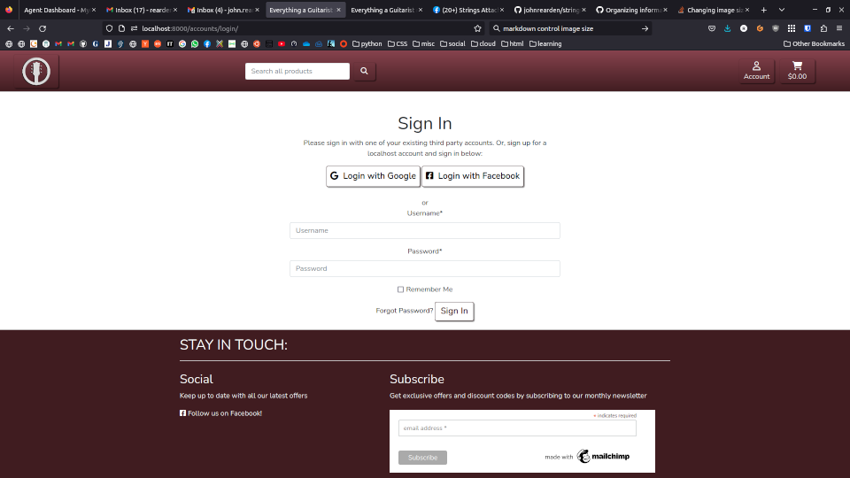

- This is the standard allauth login page, styled with the site styling, and including social login links for Google and Facebook.

Register Page

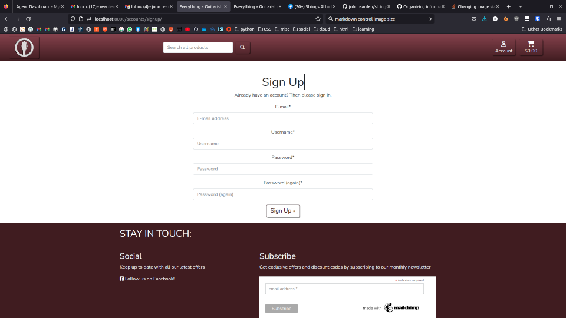

- This is the standard allauth signup page, with fields for email, username, and password + password confirmation. All fields are required.

---
The following pages are only available to logged in users.

Choose Subscription Page

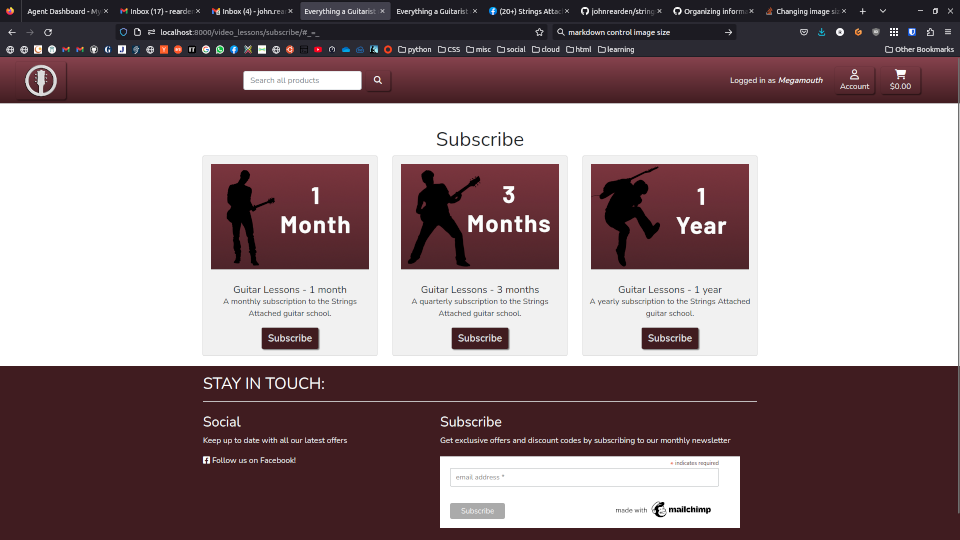

- This page presents the user with a straighforward choice between three subscription options - 1 month, 3 month or yearly. Each links to the Stripe subscription page.

Subscription Success Page

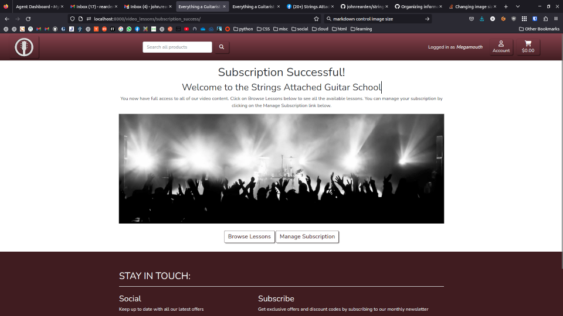

- This page displays a Subscription Successful message, with a large image of a rock concert.
- Below this are two buttons.
    - The first links to the All Lessons Page, where the subscriber can immediately browse the content 
    that they have just unlocked.
    - The second links to the Stripe Subscription Management page, where a subscriber can change their payment details, or cancel their subscription. In the event of cancellation, the content will remain accessible until the next payment due date.

---

The remaining pages are only accessible to staff

Add/Edit Product Pages

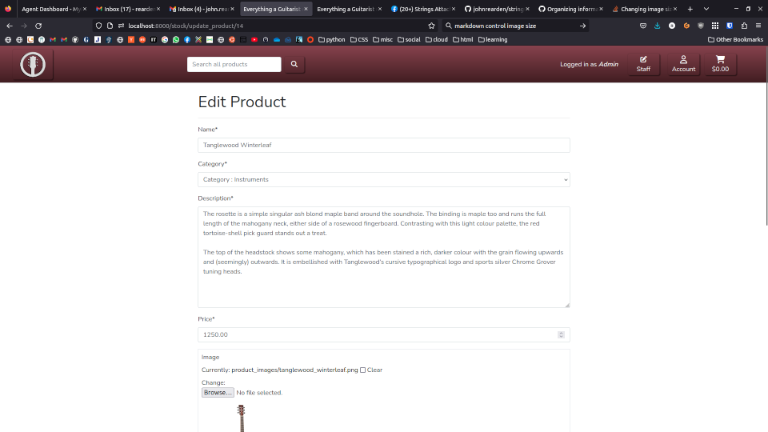

- This page consists of a form which allow the staff member to add a new product, or edit an existing one.
- The form contains 2 preview elements; one for the audio clip (if present), and one for the product image.

Product List Page

- This page consists of a table listing each product. The table header elements are clickable, and result
in the following filtering and ordering behaviours:
    - Click on Product heading : Products are ordered alternately alphabetically and reverse alphabetically
    - Click on Category : Products ordered alternately by category name forwards and reverse.
    - Click on Price : Products ordered alternately by price ascending and descending. This is current price, i.e. inclusive of any special offers that currently apply.
    - Clicking on Stock Low will bring the out-of-stock and stock-low products to the top of the table.
- Each table row has a trash icon as the last element, which opens a confirmation dialog allowing the staff member to either change their mind and retain the product, or go ahead and delete it. Deletion is permanent.
- Clicking on any table row will open the Edit Product page for that product.

Order List Page

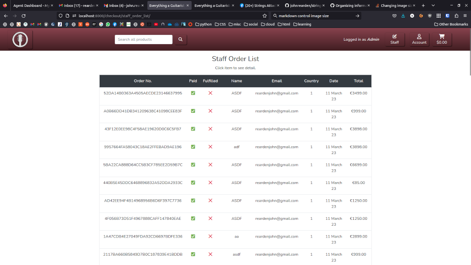

- This page consists of a table, where every order in the database is displayed. Unfulfilled orders appear first, followed by already-fulfilled orders below, with a text-muted class attribute. Clicking on any row opens the Order Detail page for that order.

Order Detail Page

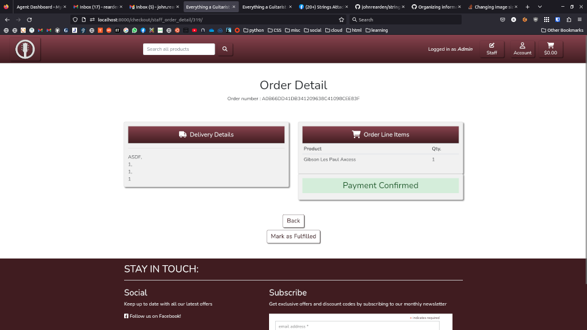

- This page consists of 2 cards, displaying the delivery details and the order line items and their quantities. A large bar at the bottom of the right-hand card (lower card on mobile) shows whether the payment for this order has succeeded or failed. 
- If the payment has succeeded, and the order is not yet fulfilled, a Mark As Fulfilled button appears at the bottom of the screen, which will set the fulfilled flag on the order to True, and cause the order to descend to the lower half of the Order List page. 
- A Back button leads back to the Order List page.

---
## Future Features

- It would be useful for staff to be able to track volume of sales of different product across different timeframes. A good feature here would be a dashboard, maybe using Plotly to display sales by product and time period.
- A feature with added benefit for subscribers would be the ability to share videos of their progress with each other, and like and comment on the videos. This would need to be moderated to ensure subscribers did not become discouraged by harsh/unfair criticism and leave the site.
- Another future feature, which I considered implementing here, is an embedded video-calling functionality, which would enable subscribers to jam with each other, or connect with real teachers for lessons and tips to help them improve their playing. Unfortunately, there wasn't enough time available to try to implement this in this version of the project.

---
[Return to top](#Strings_Attached)
# User Experience

## Design

### Fonts 

The Nunito font is used throughout the project. It's a simple, very legible sans-serif font, with a rounded appearance, particularly on headings and larger font sizes.

---

### Colour
The following colour palette was used in the project

The primary colours used are derived from the project's hero image, a cherry coloured electric guitar shown on the landing page. The orange is used wherever reference is made to a special offer, and the blue is used sparingly, only on large buttons which link to pages that are part of the payment process, i.e. the Checkout and PayNow buttons.

---

### Wireframes
#### _Product Display page_

#### _Product Detail page_

#### _Basket page_

#### _Checkout page_

#### _Lessons page_

[Return to top](#Strings_Attached)

# Development Process

## Project planning and documentation in GitHub

GitHub Issues were used to document the development steps undertaken in the project. Two issue templates, 
for [User Epics]() and [User Stories]() were used. Various labels were employed to enable quick identification of issue type including Bugs, User Epics, User Stories and Style. MoSCoW prioritisation was employed using the labels must-have, should-have and could-have. 

To break the project into manageable sprints, GitHub Projects was used to provide a Kanban board
onto which the issues were posted, moving them from 'Todo' to 'In Progress' to 'Done' as they 
were completed in turn. The iterations are documented here - [Iteration 1]

The User Epics and their related User Stories are as follows:
- Epic : [Product Browsing](https://github.com/johnrearden/strings_attached/issues/1#issue-1524567245).
    - Story : [View all products](https://github.com/johnrearden/strings_attached/issues/2#issue-1524569292)
    - Story : [Search products by category](https://github.com/johnrearden/strings_attached/issues/3#issue-1524570978)
    - Story : [Search products by keyword](https://github.com/johnrearden/strings_attached/issues/4#issue-1524572236)
    - Story : [Listen to sound of instrument](https://github.com/johnrearden/strings_attached/issues/5#issue-1524585477)
    - Story : [Watch video of instrument being played](https://github.com/johnrearden/strings_attached/issues/6#issue-1524586575)
    - Story : [See any special offers currently available](https://github.com/johnrearden/strings_attached/issues/7#issue-1524588177)
    - Story : [View associated products](https://github.com/johnrearden/strings_attached/issues/8)
- Epic : [User Interaction with Basket](https://github.com/johnrearden/strings_attached/issues/9).
    - Story : [Basket summary](https://github.com/johnrearden/strings_attached/issues/10#issue-1556662397)
    - Story : [Alter quantity of item](https://github.com/johnrearden/strings_attached/issues/11#issue-1556673678)
    - Story : [Remove item from basket](https://github.com/johnrearden/strings_attached/issues/12#issue-1556678557)
- Epic : [Checkout](https://github.com/johnrearden/strings_attached/issues/19).
    - Story : [See a summary of my basket](https://github.com/johnrearden/strings_attached/issues/20#issue-1575820431)
    - Story : [User can enter payment details securely](https://github.com/johnrearden/strings_attached/issues/21#issue-1575830296)
    - Story : [User can save their delivery information for future purchases](https://github.com/johnrearden/strings_attached/issues/22#issue-1575839948)
    - Story : [User should receive on-screen confirmation of their successful order](https://github.com/johnrearden/strings_attached/issues/23#issue-1575846062)
    - Story : [User should receive email confimation of successful order](https://github.com/johnrearden/strings_attached/issues/24#issue-1575853763)
    - Story : [Staff can see list of confirmed orders](https://github.com/johnrearden/strings_attached/issues/32#issue-1589991740)
    - Story : [User can view and edit their UserOrderProfile](https://github.com/johnrearden/strings_attached/issues/43#issue-1609772299)
- Epic : [Stock Management](https://github.com/johnrearden/strings_attached/issues/14).
    - Story : [Staff can add and edit products](https://github.com/johnrearden/strings_attached/issues/25#issue-1575866913)
    - Story : [Staff should receive email notification when stock levels are low](https://github.com/johnrearden/strings_attached/issues/27#issue-1575873891)
    - Story : [User can see when product is out of stock](https://github.com/johnrearden/strings_attached/issues/28#issue-1575880747)
    - Story : [Staff can view summary table of all products](https://github.com/johnrearden/strings_attached/issues/29#issue-1575889160)
- Epic : [Video Lesson Subscription](https://github.com/johnrearden/strings_attached/issues/34).
    - Story : [View all lessons](https://github.com/johnrearden/strings_attached/issues/33#issue-1599616289)
    - Story : [Watch video lessons ](https://github.com/johnrearden/strings_attached/issues/35#issue-1599617919)
    - Story : [Subscribe to unlock all videos](https://github.com/johnrearden/strings_attached/issues/36#issue-1599620411)
    - Story : [Add new video courses](https://github.com/johnrearden/strings_attached/issues/37#issue-1599622016)

## Search Engine Optimization
A set of long and short tail keywords was developed. The initial set was generated from a combination of brainstorming and examining the related searches returned by Google for these terms. This was then culled back to a smaller set of more targeted short- and long-tail keywords, which were each trialled on [wordtracker.com](https://wordtracker.com). This resulted in the following list of terms, ordered by volume:
|Term|Short/long-tail|Volume|Competition|
|---|---|---|---|
|'Guitar'|Short|226000|55.44|
|'Musical Instruments'|Short|20000|27.15|
|'Guitarist'|Short|7300|30.52|
|'Learn guitar'|Short|4900|15.45|
|'Online guitar lessons'|Long|4400|14.46|
|'Guitar Shop'|Short|4200|14.85|
|'Learn to play guitar'|Long|2400|12.76|
|'Music shop'|Short|2200|19.44|
|'Six string'|Short|630|15.56|
|'Buy Guitar online'|Long|440|5.63|
|'Teach yourself guitar'|Long|400|8.48|
|'Best instrument'|Short|360|8.80|
|'Best instrument to learn'|Long|320|4.61|
|'How to master guitar'|Long|200|-|
|'I want to learn guitar'|Long|150|-|
|'Guitar purchase'|Short|70|-|
|'How to improve my guitar playing|Long|55|-|
|'Beautiful sound guitar'|Long|12|-|

After completing this research, I returned to the project's templates, and made the following changes:

- &lt;title> tag in base.html:
    - Set to 'Everything a guitarist needs - Strings Attached'. This gets a high volume short-tail keyword in one of the most important SEO locations, as well as mentioning the site name. 
- &lt;meta> description tag in base.html:
    - 'The _guitar_ is the most _beautiful musical instrument_. Join us here at Strings
    Attached, where you can _learn guitar_ with our _online guitar lessons_. Of all the _musical instruments_, our passion is the _Six String_, and you can find a wide selection of gorgeous instruments in our online _Guitar Shop_.' While keeping the description reasonably short, I managed to squeeze in 7 of the chosen keywords.
- &lt;meta> keywords in base.html:
    - The following terms were added to the keywords meta tag: guitar, guitarist, guitar shop, six string, online guitar lessons.
- Heading elements:
    - On the landing page, welcome.html, the &lt;h1> element text was changed to 'For Guitarists, by Guitarists (shortened to 'For Guitarists' on smaller screens).
    - On the product detail page, the product name appears as the content of the &lt;h2> tag.
- &lt;img> tag alt attributes:
    - On the product display page, I decided to leave the alt tags for each product image as 'Image of {{ product.name }} to ensure that the product names would be indexed if a shopper happened to do a Google search using the specific name of a product.
- Image filenames:
    - The product image filenames were already changed from the source filenames to describe the product contained within them. The lesson images are all titled according to the type of guitar taught in the lesson.
- Emphasized text:
    - On the CheckoutSuccess page, the words 'video lessons' were placed within &lt;strong> tags.

## Data Model
### Products App
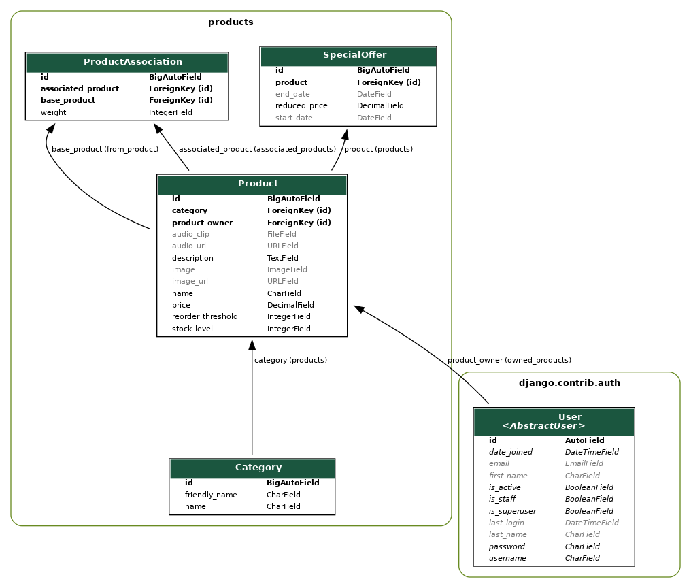

### Checkout App
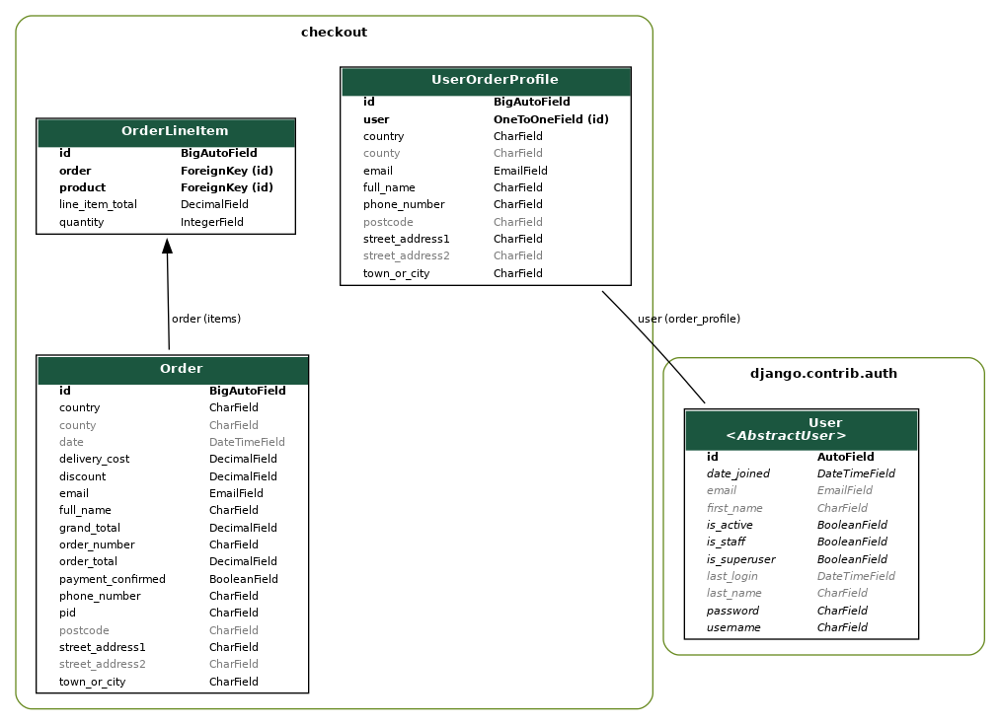

### Video_lessons App
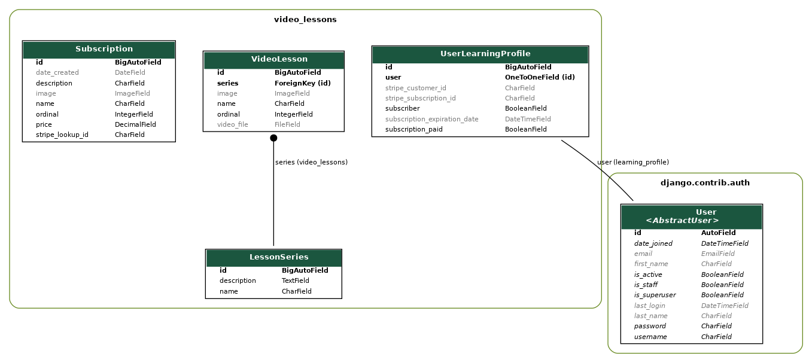

The entity-relationship diagrams above were created using the django-extensions graph_models command. For this command to execute correctly, the GraphViz package must be on the system path. For my Ubuntu machine, this is done as follows :

`sudo apt install graphviz`

The following python dependencies must be installed in the project environment :

`pip3 install pyparsing pydot`

The diagrams were created by specifying the models required for each .png file e.g.:

`python3 manage.py graph_models -a -I LessonSeries,VideoLesson,UserLearningProfile,Subscription,User -o docs/video_lessons_app_db_schema.png`

---

## Data validation:

The following decimal fields, representing currency amounts, are protected by Django's MinValueValidator, with the minimum value being set at 0.

_video_lessons.models.Subscription.price_

_products.models.Product.price_

_products.models.SpecialOffer.reduced_price_

As such, if a staff member attempts to add a product with a negative price field, the product_add form will be returned to them with the error highlighted. Similarly, the model fields representing product quantities have also been protected with a MinValueValidator.

_products.models.Product.stock_level_

_products.models.Product.reorder_threshold_

Also, the javascript running in [basket/static/js/quantity_buttons.js](https://github.com/johnrearden/strings_attached/blob/main/basket/static/js/quantity_buttons.js) checks the value of the quantity input on the page each time it changes, and disables the decrement button if the quantity <= 1, or the increment button if the quantity >= 10. It also prevents the user from typing an out-of-range value directly into the input. This code was copied from the Boutique Ado project.

---
---

# Testing
- Manual testing
- Validator testing
- User story testing
- Automated testing

---

## Manual Testing

### Feature Testing
The manual testing of features is organised by app below. Testing was carried out on a 1920 x 1080 desktop screen, a Samsung tablet and an iPhone 12 Pro.

Basket App

|Page|Feature|Action|Effect|
|---|---|---|---|
|/basket/view_basket/|All items appear in list|Add item to list in product_detail page|Item appears on table|
|/basket/view_basket/|Item quantities are correct|Add n items in product_detail page|n items appear on table|
|/basket/view_basket/|Increment button increases quantity|Click increment button|Quantity increases by 1|
|/basket/view_basket/|Decrement button decreases quantity|Click decrement button|Quantity decreases by 1|
|/basket/view_basket/|Minimum quantity is 1|Decrement quantity as far as 1|Decrement button becomes inactive|
|/basket/view_basket/|Maximum quantity is 10|Increment quantity as far as 10|Increment button becomes inactive|
|/basket/view_basket/|Multiple quantity changes allowed before reload|Click incr. and decr. buttons in quick succession|Clicking the incr and decr buttons repeatedly does not reload page. After a short pause, upon ceasing clicking, page reloads.|
|/basket/view_basket/|Message is displayed when page reloads after quantity change|Click incr. button and wait for short pause|Page reloads and message displayed with new quantity|
|/basket/view_basket/|Bin icon removes item entirely|Click bin icon|Item is removed.|
|/basket/view_basket/|'You have nothing in your basket' message displayed if basket is empty|Navigate to page by clicking basket icon in navbar without any items|Message appears correctly|
|/basket/view_basket/|Shop link returns user to products page|Clicked on shop link|User is redirected to products page|
|/basket/view_basket/|Clear all link empties basket and returns user to products page|Click on 'clear all' link|User is redirected to products page, and basket is now empty|
|/basket/view_basket/|Subtotal is displayed correctly|Add 2 products to basket|Subtotal is sum of both product prices|
|/basket/view_basket/|Delivery charge displayed correctly|Add instrument to basket|No delivery charge appears
|/basket/view_basket/|Delivery charge displayed correctly|Add non-instrument item to basket|Standard delivery charge is displayed|
|/basket/view_basket/|Item price displayed correctly|Add item to basket and compare price with that on product_detail page|Prices are equal|
|/basket/view_basket/|Special offer price displayed correctly|Add item on special offer to basket and compare price with price on product_detail page|Prices are equal|
|/basket/view_basket/|Checkout button redirects user to /checkout/ page|Click button|Page redirects appropriately|
|/basket/view_basket/|Special offer banner displays at top of screen if basket item is on offer|Add special offer item to basket| Banner displays with correct special offer price|
|/basket/view_basket/|Special offer tag appears below product name if basket item is on offer|Add special offer item to basket|Tag displays correctly|
|/basket/view_basket/|Direct input of invalid quantity should be corrected|Try to type out of range number in quantity input directly|Javascript on page changes quantity input value to fall within legal range|

Products app

|Page|Feature|Action|Effect|
|---|---|---|---|
|/products/|Special offer banner appears|Ensure there are live special offers in DB|Banner appears correctly
|/products/|Special offer banner cycles between all available offers|Ensure multiple offers in DB|Banner cycles correctly between offers
|/products/|Special offer add button adds 1 item to basket|Click add button|Basket contains 1 item
|/products/|Category links filter products by correct category|Click each link|Only items of this category are displayed
|/products/|Entering text in search field limits results|Entered search term 'ernie'|Only Ernie ball products returned
|/products/|Entering nonsense text string in search field gives no results|Entered 'asdfkasdj' in search field|No results were returned, message displayed to user
|/products/|Clicking on product card links to product detail page|Clicked on card|Product detail page displayed correctly
|/products/|Out of stock items are displayed greyed out, with out-of-stock badge|Reduce stock level of a product to 0 in admin panel|Item appears as intended
|/products/|Items on special offer should have special offer badge|Create a special offer for a product in admin panel|Badge appears correctly
|/products/|Items on special offer should display special offer price|Create a special offer for a product in admin panel|Special offer price displays instead of normal price
|/product_detail/|Product image, name and description should appear|Select product from products/ page|Image, name and description appear correctly
|/product_detail/|Price of product should appear|Select product|Price and category displayed correctly
|/product_detail/|Special offer banner should appear below description|Assign special offer to product|Banner appears correctly
|/product_detail/|Out of stock products should show grey out-of-stock banner instead of quantity input and buttons|Select product with stock_level == 0|Grey banner appears; no input or buttons appear
|/product_detail/|Add to basket button should not appear for out-of-stock items|Select product with stock_level == 0|Add to basket button is hidden
|/product_detail/|Back to shop button links to product_display page|Click on button|User redirected to product_display page
|/product_detail/|Add to basket increments quantity in basket by quantity in quantity input|Increment quantity to 3, click AddToBasket button, check basket contents|Basket contents incremented by 3
|/product_detail/|View basket button links to /basket/view_basket page|Click ViewBasket button|User is redirected to correct page
|/product_detail/|Audio clip appears and can be played if exists|Select product with audio clip|Audio player element appears on page, and plays instrument audio clip correctly
|/product_detail/|Associated products appear below main content if exist|Select product with associated products assigned|Products appear correctly, with price tag, image and name
|/product_detail/|Associated product cards contain link to detail page for that item|Click on information button on associated product card|User is redirected to the product_detail page for that item
|/product_detail/|Associated product cards contain link to add item to card without redirection|Click on cart increment button on item card|Basket now contains 1 extra of this item; message displayed to user instead of redirection
|/product_detail/|Edit product button appears for staff only|Login as staff; then logout|Button appears when logged in, and is hidden when logged out

Checkout app

|Page|Feature|Action|Effect|
|---|---|---|---|
|/checkout/|Personal details fieldset is filled if UserOrderProfile exists|Create UserOrderProfile in admin panel|Details are filled correctly
|/checkout/|Stripe payment form appears|Click checkout on /view_basket/ page|Stripe element appears correctly|
|/checkout/|Pay now button initiates purchase process with valid card details|Fill in card details; click PayNow button|Spiiner and overlay appear; Stripe payment initiated.
|/checkout/|Summary of basket displays correctly|Add items to basket and proceed to checkout|Item names, quantities and costs appear correctly
|/checkout/|ViewBasket button links back to /view_basket/ page|Click button|User is redirected to page
|/checkout/|Cancel purchase button redirects to /product_display/ page|Click button|User is redirected successfully|
|/checkout/|Stripe errors display below each field in payment fieldset|Enter invalid card number|Error appears below card input|
|/checkout/|Stripe errors display below each field in payment fieldset|Enter invalid date|Error appears below expiration input|
|/checkout/|Stripe errors display below each field in payment fieldset|Enter invalid CVC|Error appears below CVC input|
|/checkout/|Stripe message appears at bottom of payment fieldset if card is declined|Enter card number 40000000000000002 to simulate declined card|Error message appears correctly|
|/checkout/|Interactive elements disabled when PayNow button is clicked|Click button|No buttons are clickable while payment process is ongoing|
|/checkout/|Interactive elements reenabled if Stripe error is returned|Click PayNow button with Stripe decline card number|When overlay is removed and error message appears, all elements are clickable again|
|/checkout/checkout_succeeded/|Delivery details displayed|Complete payment on /checkout/ page|Delivery details are summarized in a table|
|/checkout/checkout_succeeded/|Order summary displayed|Complete payment|Order summary displayed including line items, delivery cost and total with item count|
|/checkout/checkout_succeeded/|VideoLesson button links to /all_lessons/ page|Click button|User is redirected to page with all available video lessons|
|/checkout/staff_order_list/|All orders displayed, ordered first by whether they are paid, then by whether fulfilled, and lastly by date|Load page, having entered some order on the DB|Orders display correctly, corresponding to their fields in the admin panel|
|/checkout/staff_order_list/|Paid and fulfilled orders are greyed out|Select order, click on row, mark as fulfilled|Order row is now greyed out in the table|
|/checkout/staff_order_list/|Orders display in correct order|Load page with orders in DB|Orders appear ordered by paid, then fulfilled, then by date.
|/checkout/staff_order_list/|Clicking on an order's row in the table links to the /staff_order_detail/ page|Click on row|Order detail for that row is displayed|
|/checkout/staff_order_detail/|Delivery details displayed correctly|Navigate to page|Delivery details are displayed as required|
|/checkout/staff_order_detail/|Order line items displayed|Navigate to page|Line items for order displayed correctly|
|/checkout/staff_order_detail/|Payment Confirmed message displayed|Complete purchase and then navigate to page|Message displays correctly
|/checkout/staff_order_detail/|Payment Failed message displayed|Attempt purchase with Stripe invalid card code, navigate to page|Payment failed message displayed below order line items.
|/checkout/staff_order_detail/|MarkAsFulfilled button switches boolean fulfilled flag to True|Click on button, navigate back to /staff_order_list/|Order now marked as fulfilled, greyed out|
|/checkout/staff_order_detail/|MarkAsFulfilled button does not appear if payment has failed|Attempt purchase with Stripe invalid card code and navigate to page|Button does not appear|

Welcome app and navbar

|Page|Feature|Action|Effect|
|---|---|---|---|
|/|Hero image and title appear|Navigate to page|Elements appear correctly|
|/|Shop button links to /products/ page|Click button|User is redirected to correct page|
|/|Subscribe button links to /video_lessons/all_lessons/ page|Click button|User is redirected to correct page|
|/|Logo button causes page to reload|Click logo|Page reloads|
|/|Typing term in search input opens /products/ page filtered to that search term|Type in term and hit Q button|/products/ page opens, with results filtered to that search term|
|/|User is notified of login status on navbar|Login as user|Message 'logged in as {user}' appears on navbar|
|/|Navbar - account dropdown button reveals login and register links|Click dropdown button|Correct links appear|
|/|Navbar - account dropdown login link leads to allauth login page|Click link|User redirected to login page|
|/|Navbar - account dropdown register link leads to allauth registration page|Click link|User redirected to registration page|
|/|Navbar - basket icon appears, with current total amount of items in basket|Add item to basket and navigate back to landing page|Icon and correct balance displayed at right hand end of navbar
|/|Navbar - when logged in as a staff member, a staff dropdown button appears|Login as admin|Staff dropdown button appears|
|/|Navbar - staff dropdown contains working link to /stock/add_product/ form|Click dropdown button|Add product form appears correctly|
|/|Navbar - staff dropdown contains working link to /stock/staff_product_list/all|Click dropdown button|Staff product list appears with all products displayed|
|/|Navbar - staff dropdown contains working link to /checkout/staff_order_list/|Click dropdown button|Staff Order List appears correctly|

Stock app

|Page|Feature|Action|Effect|
|---|---|---|---|
|/stock/add_product/|Staff members can create new product using a form|Navigate to page, fill out form|New product appears in admin panel|
|/stock/add_product/|Staff member is redirected to /staff_product_list/ after adding a new product|Add a new product|Staff member is redirected successfully
|/stock/update_product/|Staff members can update an existing product using a form|Navigate to page, alter fields on form|Updated product visible in /staff_product_list/ page|
|/stock/update_product/|Staff member is redirected to /staff_product_list/ after adding a new product|Add a new product|Staff member is redirected successfully
|/stock/add_product/|Staff member can see error message when field validation requirements are not met|Enter negative amounts for stock_level, reorder_threshold and price|Error messages appear beneath each form field & product is not saved
|/stock/update_product/|Staff member can see error message when field validation requirements are not met|Enter negative amounts for stock_level, reorder_threshold and price|Error messages appear beneath each form field & product is not saved|
|/stock/staff_product_list/|Staff can see each product displayed in a table|Navigate to page|Each product appears in the table|
|/stock/staff_product_list/|Special offer badge appears on products with live special offers|Set special offer on product in admin panel|Green special offer badge appears next to product name|
|/stock/staff_product_list/|Out-of-stock badge appears on products with stock_level == 0|Set stock level on test product to 0|Red 'o/s' badge appears next to product name|
|/stock/staff_product_list/|Quantity cell for out-of-stock product has red backround|Set stock level on test product to 0|Red background appears successfully|
|/stock/staff_product_list/|Quantity cell for low-stock product has orange background|Set stock level on test product to below reorder_threshold|Background on quantity cell is orange|
|/stock/staff_product_list/|Clicking on Product header orders products alternately alphabetically and reverse-alphabetically|Click on header|Products are ordered correctly in alternating sequence|
|/stock/staff_product_list/|Clicking on Price header orders products alternately by increasing and decreasing price|Click on header|Products are ordered correctly in alternating sequence|
|/stock/staff_product_list/|Click on Stk header orders products by 1-out-of-stock, 2-low-stock, 3-stock-normal|Click on header|Out-of-stock products appear first, followed by low-stock, followed by everything else|
|/stock/staff_product_list/|Click on category header orders products alternately by increasing and decreasing category id|Click on header|Products appear in correct order (this is to facilitate grouping products in the list by category)|
|/stock/staff_product_list/|Click on trash icon brings up confirmation modal|Click on icon|Modal appears|
|/stock/staff_product_list/|Click on 'No, wait!' button dismisses model without deleting product|Click button|Modal vanishes, product remains|
|/stock/staff_product_list/|Click on 'Go ahead and delete it' button in confirmation modal deletes product and reloads page with confirmation message|Click button|Modal vanishes, product gone, message appears, page reloads|

Video lessons app

|Page|Feature|Action|Effect|
|---|---|---|---|
|/video_lessons/all_lessons/|Page displays all available lessons in order, categorized by course|View page|All lessons are present, each in order under its own course heading|
|/video_lessons/all_lessons/|For non-subscribers, only the first 2 lessons link to the video_player page|View page while logged out, while logged in as non-subscriber, while logged in as non-paid-up subscriber|Only first 2 lessons are clickable|
|/video_lessons/all_lessons/|For paid-up subscribers, all lessons are clickable and redirect to the video player for that lesson|View page while logged in as paid-up-subscriber|All lessons are clickable and link correctly to video_player|
|/video_lessons/all_lessons/|Panel on left of lesson display shows a subscribe link which links to the Stripe subscription page|View page as logged in non-subscriber|Subscribe link appears and links to Stripe subscription page|
|/video_lessons/all_lessons/|Subscribe link redirects to login/register page for anonymous user|View page as anonymous user|Subscribe link redirects to login/register page|
|/video_lessons/video_player/|Page shows a video element with lesson video loaded and playable|Click lesson thumbnail on /all_lessons/ page|video element appears correctly|
|/video_lessons/video_player/|Previous video button is disabled when viewing first video|Select first video|Button is disabled|
|/video_lessons/video_player/|Next video button is disabled when viewing last video|Select last video|Button is disabled|
|/video_lessons/video_player/|Next/previous buttons move forwards/backwards through lesson series one video at a time|Click next and previous buttons|Next/previous video appears in video element as appropriate|
|/video_lessons/video_player/|See all lessons button links back to /all_lessons/ page|Click button|User is redirected to /all_lessons/ page|
|/video_lessons/video_player/|All lesson thumbnail lessons are visible and clickable for paid up logged in subscribers|View page as paid up logged-in subscriber|All thumbnails are visible and clickable|
|/video_lessons/video_player/|Only first 2 thumbnail lessons are clickable for users who are not paid-up subscribers|View page as anonymous user, as logged-in non-subscriber and as non-paid up logged in subscriber|Only first 2 videos shown|
|/video_lessons/subscription_success/|Page has link back to /all_lessons/ page|Complete a test subscription|Link appears on page and functions correctly|
|/video_lessons/subscription_success/|Page has working link to Stripe subscription management console|Click link|User is redirected to Stripe billing console, where they can change payment methods and cancel their subscription|

---

### Responsiveness

All pages on the live site were tested with the default list of devices in Chrome Devtools.
It should be noted that the three pages only accessible to staff (Product List, Order List and Order Detail) contain large amounts of data in tabular form, and are more usefully viewed on small devices in landscape mode. A note to that effect appears at the top of each of these three pages, on small screens only. Various non-essential columns are hidden on medium screens, but a minimum number of columns is necessary to make the pages useful, and these would not fit on a small screen in portrait mode. As these pages are not consumer-facing, I judge that this is an acceptable compromise.

### Lighthouse

The lighthouse best practices tab returned a lower than ideal value due to the presence of 3 vulnerabilities in JQuery 3.3.1. I checked the actual vulnerabilities themselves on [www.cve.org](https://cve.org):
- CVE-2020-11022 : jQuery >= 1.2, <3.5.0
    - _Passing HTML from untrusted sources in DOM manipulation methods may execute untrusted code._
- CVE-2020-11023 : jQuery >= 1.2, <3.5.0
    - _Passing HTML containing &lt;option> elements from untrusted sources - even after sanitizing it - to one of jQuery's DOM manipulation methods (i.e. .html(), .append(), and others) may execute untrusted code._ 
- CVE-2019-11358 : jQuery < 3.4.0
    - _jQuery before 3.4.0, as used in Drupal, Backdrop CMS, and other products, mishandles jQuery.extend(true, {}, ...) because of Object.prototype pollution. If an unsanitized source object contained an enumerable __proto__ property, it could extend the native Object.prototype._

jQuery is used in this project only as a dependency of Bootstrap 4.3.1, and without going through the Bootstrap source code, I can't be confident that these functions are not used by the Bootstrap JavaScript-based components. Unfortunately, I only discovered these vulnerabilities late in the project, and would prefer not to run the risk of using a more recent version of Bootstrap at this late stage, which might break various elements in the project. In any future projects, I'll be using Bootstrap 5, which has the added benefit of no longer depending on jQuery at all.

Accordingly, while I have included the Best Practices result on the Welcome Page, I have left it off the rest of the pages, as there is no great need to repeat bad news a dozen times!

Lighthouse results by page

- Welcome Page

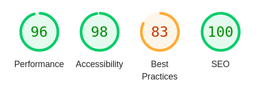

- Product Display Page

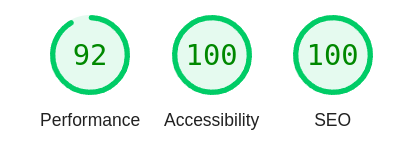

- Product Detail Page

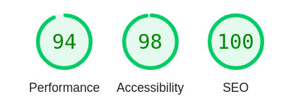

- Basket Page

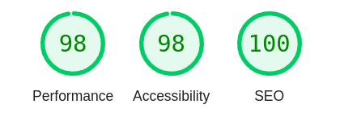

- Checkout Page

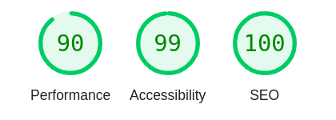

- Checkout Success Page

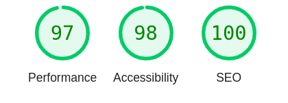

- All Video Lessons Page

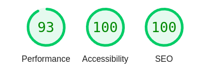

- Video Player Page

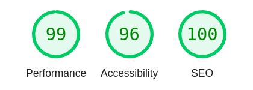

- Subscription Success Page

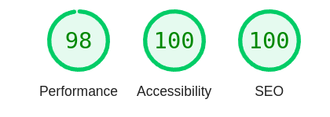

- Product List Page

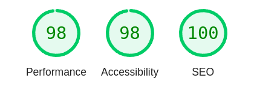

- Order List Page

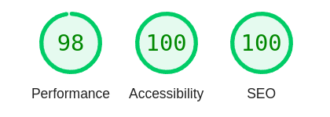

- Order Detail Page

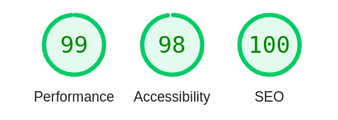

- Add/Edit Product Page

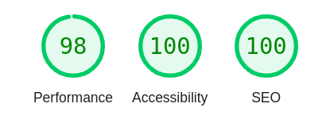

- Login Page

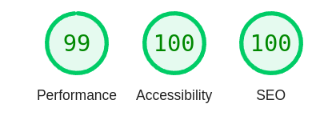

- Register Page 

---

### Code Validation

#### Python code : 
- All python code is validated by the Flake8 linter (installed in VSCode). The sole exceptions are the test classes, whose function names and implementation can be very verbose.

#### JavaScript code :
- All JavaScript code in the project was validated during development with the ESLint plugin for VSCode.

#### HTML Validation :
- All HTML files in the project were validated using the W3C Narkup Validation Service.
https://validator.w3.org/

#### CSS Validation :
- No errors were found when the single CSS file style.css was passed through the W3C Validation Service.
https://jigsaw.w3.org/css-validator/

### User Stories
The User Epics and Stories in this project are documented in three GitHub Projects, corresponding 
to the iterations that comprised the development work of the project. These can be found here :

- [Iteration 1](https://github.com/users/johnrearden/projects/7)
- [Iteration 2](https://github.com/users/johnrearden/projects/8)
- [Iteration 3](https://github.com/users/johnrearden/projects/9)

Alternitively, the Epics and Stories are individually linked here :

- [Epics and Stories](#development-process)

---
## Stripe Webhook Testing

### Stripe Payment Flow
The payment flow handling differs from the Boutique Ado project. I decided that the application would be more robust if orders were saved to the database _before_ the Stripe payment process was initiated, with a flag, 
payment_confirmed set to false. This ensures that any order made is recorded before the network back and forth begins. It also allows the application to send the order_number field from the order instance to Stripe as metadata for later retrieval, so that the order does not need to be built from the basket contents. When the Stripe confirmPayment method (called from stripe_payments.js) promise is fulfilled, the front-end then sends a POST request back to the endpoint, which sets the payment_confirmed flag to True. 

In the event that the promise is rejected, or the POST request fails, the Stripe webhook event (stripe.payment_intent.succeeded) will pass the metadata back to the webhook handler. If the order is present in the database, the handler ensures that the payment_confirmed flag is set to True. If it is not present, the handler will construct a new order from the basket information encoded in the metadata as an insurance policy.

Another advantage of this approach is that orders whose payments are not processed remain on the system, and can be retrieved by staff and users if necessary at a later point (although this is not implemented in the project).

### Webhook Tests
The application listens for 5 Stripe webhook events, and takes appropriate action based on each. The events
were tested by adding a local listener on the dashboard webhook page, which forwards the webhook events
to the development server on localhost:8000. The webhook for the deployed project on Heroku was disabled for these tests, as the deployed and development versions of the project both use the production database. Tests for each webhook are manual rather than automated.

- stripe.payment_intent.succeeded:
    - The handler retrieves the order_number from the event metadata and checks that the order exists. If
    so, it ensures that the payment confirmed flag is set to True. This was tested by commenting out the code in checkout.views.PaymentConfirmedView that sets the flag to True and then, after the payment has been processed and the webhook event received, checking the flag in the admin panel. Results as follows :
        - With webhook forwarding disabled : payment_confirmed flag is False
        - With webhook forwarding enabled : payment_confirmed flag is True.
    So, the handler is working correctly when an order is already on the system. Next the code in the handler is altered by setting the value of the result_set returned by the search to None, creating an order on the site and then initiating a payment. This should result in a duplicate order being created, the same in all respects as the original except for its order_number. The results were as follows : 
        - With webhook forwarding disabled : Only one order exists in the database.
        - With webhook forwarding enabled : A duplicate order also exists in the database.
    So, we can conclude that this webhook handler is working as intended.

- stripe.payment_intent.payment_failed
    - This handler just returns a HTTP 200 response code to Stripe. The stripe webhook dashboard confirmed that
    the event had been fired and that the 200 response had been received.

- stripe.checkout.session.completed
    - Unlike the payment_intent.succeeded webhook, this hook plays a crucial role in confirming a subscription payment has been processed by Stripe, as it is the only means by which notice of a successful payment will be sent. We need to confirm that subscriber flag is set to True, and that the stripe_customer_id and stripe_subscription_id fields are set correctly on the UserOrderProfile record. The test consists of examining the UserOrderProfile record created when the user chooses a subscription plan, and comparing it with the same record after the payment has been processed. Results as follows (with invoice_paid webhook disabled in order to isolate this webhook) :
        - With webhook forwarding disabled : subscriber flag set to False, stripe_subscription_id and stripe_customer_id fields unfilled.
        - With webhook forwarding enabled : subscriber flag set to True, stripe_subscription_id and stripe_customer_id filled correctly (compared to stripe webhook event detailed on dashboard).
    So, we can conclude that this handler is working correctly.

- stripe.invoice_paid
    - This handlers task is simply to set the UserOrderProfile's subscription_paid flag to True, so
    that the subscription is live and all video content is available to the user. The test consists of checking the UserOrderProfile record before proceeding to process payment for a subscription, and confirming that the flag is set afterwards. Results as follows :
        - With webhook forwarding disabled : subscription_paid flag set to False following payment.
        - With webhook forwarding enabled : subscription_paid flag set to True following payment.

- stripe.invoice.payment_failed
    - This handler sets the subscription_paid flag to false when it is received. Unfortunatly it is not possible to trigger this webhook either from the Stripe dashboard or from the CLI, so the only way to test it is to supply stripe with a test card with a short expiration date, and wait for the subscription period to end and the test to fail! A bit of research uncovered [this project](https://github.com/stripe/stripe-mock), released by Stripe, but the time required to get the mock HTTP server up and running and the fact that it is stateless anyway(the responses to mock API calls are hardcoded) means that I'll reluctantly have to leave this handler untested. With a fully-fledged e-commerce application, before switching to live mode on Stripe, I would set up a fake product on the backend and a corresponding product on the Stripe dashboard with a subscription period of 1 day (the shortest option Stripe currently offers) and show up punctually to observe the handler fire 24 hours later.
---

## Automated Testing

### Testing django views, models and forms.
A full suite of automated tests is included in the project. The tests for each app can be found in each apps test/ folder, and can be run with the following command :

`python3 manage.py test`

The most recent coverage report can be found in the htmlcov/ folder in the project's root folder, and can be accessed by running python's built in http.server from that root folder as follows :

`python3 -m http.server`

The coverage html report can be generated using the following commands :

`coverage run manage.py test`

`coverage html`

[Return to top](#Strings_attached)

---
---

# Bugs

- A number of other bugs and their solution are documented in the issues tracker on GitHub, such as :
    - [Special offer not flagged on products page](https://github.com/johnrearden/strings_attached/issues/42)
    - [Special offer still displayed after expiry date](https://github.com/johnrearden/strings_attached/issues/41)
    - [Application relies on order in which webhooks are received](https://github.com/johnrearden/strings_attached/issues/40)
    - [Stripe subscription flow calls payment_intent.succeeded webhook](https://github.com/johnrearden/strings_attached/issues/39)
    - [uri_mismatch error for Google social sign-in on Heroku](https://github.com/johnrearden/strings_attached/issues/38)
    - [Payment submits with card errors](https://github.com/johnrearden/strings_attached/issues/30)
    - [Repeating quick pressing of increment and decrement buttons loses click info](https://github.com/johnrearden/strings_attached/issues/13)
    
## Remaining Bugs
There are (hopefully) no remaining bugs in the project.

[Return to top](#Strings_attached)

---
---

# Libraries and Programs Used
1. [Pencil](https://pencil.evolus.vn/)
    - Pencil was used for wireframing some of the pages in the project.
2. [Balsamiq](https://balsamiq.com/)
    - Balsamiq was used for wireframing the initial pages in the project.
2. [Heroku](https://www.heroku.com/)
    - Heroku was used to deploy the project
3. [Git](https://git-scm.com/)
    - Version control was implemented using Git through the Github terminal.
4. [Github](https://github.com/)
    - Github was used to store the projects after being pushed from Git and its cloud service [Github Pages](https://pages.github.com/) was used to serve the project on the web. GitHub Projects was used to track the User Stories, User Epics, bugs and other issues during the project.
5. [Visual Studio Code](https://code.visualstudio.com/)
    - VS Code was used locally as the main IDE environment, with the ESLint and Flake8 linters installed for JavaScript and Python code validation respectively.
6. [pytest](https://docs.pytest.org/en/7.1.x/)
    - Pytest was used for automated testing.
7. [GIMP](https://www.gimp.org/)
    - The GIMP graphic editing package was used to manipulate and export all images used in the project.
8. [GraphViz](https://graphviz.org/)
    - This open-source graph visualization package was used along with the pydot package to generate ER diagrams from the models in the project.

---
---

# Deployment

## Using an AWS S3 bucket for static storage.
The project stores all of its static and media files (including images and audio clips uploaded when adding products by staff) in an S3 bucket, which is publicly accessible for downloading files to facilitate this use. Detailed instructions are available [here](https://aws.amazon.com/s3/?nc2=h_ql_prod_fs_s3) on how to set up and configure the S3 bucket on the AWS side.

On the Django side, the following lines in the project's settings.py file are necessary : 

    AWS_STORAGE_BUCKET_NAME = '{PROJECT NAME}'
    AWS_S3_REGION_NAME = '{REGION}'
    AWS_ACCESS_KEY_ID = os.environ.get('AWS_ACCESS_KEY_ID')
    AWS_SECRET_ACCESS_KEY = os.environ.get('AWS_SECRET_ACCESS_KEY')
    AWS_S3_CUSTOM_DOMAIN = f'{AWS_STORAGE_BUCKET_NAME}.s3.amazonaws.com'

    # Static and Media files
    STATICFILES_STORAGE = 'custom_storages.StaticStorage'
    STATICFILES_LOCATION = 'static'
    DEFAULT_FILE_STORAGE = 'custom_storages.MediaStorage'
    MEDIAFILES_LOCATION = 'media'

    # Override static and media URLs in production
    STATIC_URL = f'https://{AWS_S3_CUSTOM_DOMAIN}/{STATICFILES_LOCATION}/'
    MEDIA_URL = f'https://{AWS_S3_CUSTOM_DOMAIN}/{MEDIAFILES_LOCATION}/'

Replace the PROJECT_NAME and REGION placeholders with the appropriate values for your project.

## Deploying the app on Heroku
1. Log into Heroku and navigate to the Dashboard.
2. Click on the 'New' button.
3. Choose a unique app name, and select the region closest to you.
4. Create a database on Heroku (I elected to stay on Heroku and pay the monthly fee)
    - Click on the Resources tab.
    - Click the Find more add-ons button.
    - Select Heroku Postgres, and click on Install Heroku Postgres.
    - Select a plan (default = Mini @ $5.00 a month, which I'm using), and select your app.
    - Return to Resources tab and click on the Heroku Postgres icon, then select the settings tab and click on Database Credentials. Copy the URI to your clipboard. Paste it to your env.py file using the key "DATABASE_URL". This will allow you to use the same database for development and production.
5. Click the settings tab on the Dashboard, and click the button to Reveal Config Vars. Your database url should be populated here already. Add your Django secret key to the config variables, and set the PORT to 8000.
6. In your local repository, add a Procfile to the root directory of the project, containing the following line :  `web: gunicorn strings-attached.wsgi`.
7. Add the url of your Heroku project to the `ALLOWED_HOSTS` list in `settings.py`.
8. Create 2 social apps, for Facebook and Google social signin, and add their respective API-keys and SECRETS to the database. Add your application details and callback urls to the respective Google and Facebook OAuth dashboards.
9. Open a Stripe account, and add your STRIPE_PRIVATE_KEY and STRIPE_SECRET to the config vars. Set up a webhook to hit your webhook endpoint, and copy the STRIPE_WEBHOOK_SECRET to config vars as well.
10. Create 3 products in the Products tab of the Stripe Developer console, to match the 3 subscription durations in the project, and add their respective API-keys to their corresponding Subscription instances in the database.
11. Set DEBUG to False, and commit your changes and push to GitHub.
12. In Heroku, navigate to the Settings Tab, and within this the Buildpacks section, and click on Add Buildpack. Select the python buildpack, and save changes.
13. On the Dashboard, select the Deploy tab, and under the Deployment Method heading, select the
GitHub icon to connect your Heroku project to your GitHub repo. Enter your repository name in the text input, and click Search, and then when your repo appears, click Connect.
14. Under the Manual deploy section, click Deploy Branch. You should receive this message - 'Your app was successfully deployed". Click view to see the app running in the browser.

## Making a local clone
1. Open a terminal/command prompt on your local machine.
2. Navigate to the folder on your local machine where you would like to clone the project.
3. Enter the command : `git clone 'https://github.com/johnrearden/strings-attached.git'`

## Running the app in your local environment
1. Create a virtual enviroment in the new project folder using the command `python3 -m venv venv`
2. Activate the virtual environment : `source venv/bin/activate`
3. Install the project requirements : `pip3 install -r requirements.txt`
4. Create an env.py file containing the following variables (see env.example.py in the root directory of the project for a complete list of variables necessary to run the app) :
    - AWS_ACCESS_KEY_ID : Used to access S3 bucket for static and media files
    - AWS_SECRET_ACCESS_KEY : As above
    - BASE_URL : The root URL for the dev project, usually `http://localhost:8000/`
    - DATBASE_URL : This is the url generated by Heroku - see [Deploying the app](#deploying-the-app-on-heroku)
    - DEBUG : Set to True for development work locally
    - EMAIL_APP_PASSWORD : The email password for your email account
    - EMAIL_APP_USER : A personal or ephemeral email account you can use to test your email functionality.
    - PORT : Default Django port is 8000.
    - SECRET_KEY : This is the Django secret key.
    - STRIPE_PRIVATE_KEY : Stripe private key credential
    - STRIPE_PUBLIC_KEY : Stripe public key credential
    - STRIPE_WEBHOOK_SECRET : Stripe webhook signing secret

[Return to top](#Strings_attached)

---
---

# Credits
Structure of extensible base.html page largely copied from Boutique Ado Walkthrough
https://github.com/Code-Institute-Solutions/boutique_ado_v1/blob/250e2c2b8e43cccb56b4721cd8a8bd4de6686546/templates/base.html

Hero image of guitar on guitar stand - Kelvin Franca on Pexels
https://www.pexels.com/@kelvinernandi/

Truncate text in a paragraph tag in html
https://stackoverflow.com/questions/47761085/how-can-i-set-a-character-limit-for-paragraph

Remove up and down arrows from number input
https://www.geeksforgeeks.org/how-to-disable-arrows-from-number-input/

Combining querysets in Django
https://stackoverflow.com/questions/431628/how-to-combine-multiple-querysets-in-django

Testing in Django
https://realpython.com/testing-in-django-part-1-best-practices-and-examples/

Email send test not working because of missing User email field
https://stackoverflow.com/questions/39493749/django-tests-for-sending-email

Generate database schema diagram from project models
https://django-extensions.readthedocs.io/en/latest/graph_models.html

Make a Django class based view CSRF exempt
https://www.programmersought.com/article/2914850608/

Testing a DoesNotExist exception on a query
https://stackoverflow.com/questions/11109468/how-do-i-import-the-django-doesnotexist-exception

Mocking stripe methods in a view to enable testing
https://stackoverflow.com/questions/31284622/mock-stripe-methods-in-python-for-testing

Prevent a table cell event listener from also firing its table row event listener
https://developer.mozilla.org/en-US/docs/Web/API/Event/stopPropagation

Creating an xml sitemap
https://www.xml-sitemaps.com/

# Acknowledgements

I'd like to acknowledge the invaluable assistance I received from my tutor, Celestine Okoro, 
and the advice and encouragement I received from my cohort facilitators Kenan Wright, Kasia Bogucka, and Paul O'Donnell.
Thanks also to my fellow students whose help in our weekly stand-ups made a big difference.

[Return to top](#Strings_attached)
